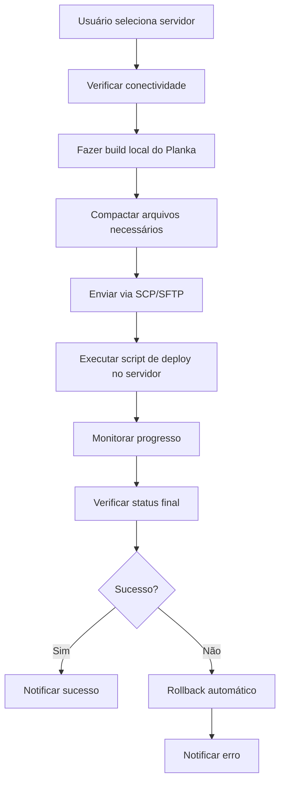

# 🚀 Plano de Implementação - Deploy Remoto do Planka

## 📋 Resumo Executivo

Este documento descreve o plano detalhado para implementar uma funcionalidade de deploy remoto do Planka através do dashboard de tarefas. A funcionalidade permitirá enviar o Planka de produção para servidores remotos configurados, com interface para seleção do servidor e execução automática do deploy.

## 🎯 Objetivos

- **Objetivo Principal**: Implementar deploy remoto do Planka através do dashboard
- **Objetivo Secundário**: Criar sistema de monitoramento e rollback automático
- **Objetivo Terciário**: Integrar com sistema de servidores existente

## 🏗️ Arquitetura da Solução

### Estrutura de Módulos

```
dashboard-tarefas/
├── core/
│   ├── deploy_manager.py          # Gerenciador principal de deploy
│   └── planka_deployer.py         # Lógica específica do deploy do Planka
├── interface/
│   ├── abas/
│   │   └── principal.py           # Modificar para adicionar seção de deploy
│   └── componentes/
│       └── deploy_panel.py        # Interface do painel de deploy
├── scripts/
│   ├── deploy_planka.sh           # Script de deploy para servidor remoto
│   └── deploy_planka.bat          # Script de deploy para Windows
└── config/
    └── deploy_config.json         # Configurações de deploy
```

### Fluxo de Deploy



## 📁 Arquivos a Criar/Modificar

### Novos Arquivos

#### 1. `core/deploy_manager.py`
```python
class DeployManager:
    """
    Gerenciador principal de deploy.
    Coordena todo o processo de deploy remoto.
    """
    
    def __init__(self, settings, log_manager):
        self.settings = settings
        self.log_manager = log_manager
        self.servidores_manager = ServidoresManager(settings)
    
    def fazer_deploy(self, servidor_id, opcoes_deploy):
        """Executa o deploy completo para um servidor."""
        
    def verificar_status_remoto(self, servidor_id):
        """Verifica o status da aplicação no servidor remoto."""
        
    def fazer_rollback(self, servidor_id):
        """Executa rollback em caso de falha."""
```

#### 2. `core/planka_deployer.py`
```python
class PlankaDeployer:
    """
    Especializado em deploy do Planka.
    Gerencia aspectos específicos do deploy do Planka.
    """
    
    def __init__(self, deploy_manager):
        self.deploy_manager = deploy_manager
    
    def preparar_build_deploy(self):
        """Prepara build otimizado para deploy."""
        
    def compactar_arquivos(self):
        """Compacta apenas arquivos necessários."""
        
    def enviar_para_servidor(self, servidor, arquivo_compactado):
        """Envia arquivos via SCP/SFTP."""
        
    def executar_deploy_remoto(self, servidor):
        """Executa script no servidor remoto."""
```

#### 3. `interface/componentes/deploy_panel.py`
```python
class DeployPanel(ttk.Frame):
    """
    Painel de interface para deploy remoto.
    """
    
    def __init__(self, parent, deploy_manager, **kwargs):
        super().__init__(parent, **kwargs)
        self.deploy_manager = deploy_manager
        self._criar_interface()
    
    def _criar_interface(self):
        """Cria a interface do painel de deploy."""
        # Dropdown para seleção de servidor
        # Botões de ação
        # Área de logs
        # Progress bar
```

#### 4. `scripts/deploy_planka.sh`
```bash
#!/bin/bash
# Script de deploy para servidor remoto

set -e

echo "🚀 Iniciando deploy do Planka..."

# 1. Parar containers existentes
echo "⏹️ Parando containers existentes..."
docker-compose down

# 2. Fazer backup da versão atual
echo "💾 Fazendo backup da versão atual..."
tar -czf backup_$(date +%Y%m%d_%H%M%S).tar.gz .

# 3. Extrair nova versão
echo "📦 Extraindo nova versão..."
tar -xzf planka_deploy.tar.gz

# 4. Configurar variáveis de ambiente
echo "⚙️ Configurando variáveis de ambiente..."
cp .env.sample .env

# 5. Iniciar novos containers
echo "🏭 Iniciando novos containers..."
docker-compose up -d

# 6. Verificar saúde da aplicação
echo "🏥 Verificando saúde da aplicação..."
sleep 30
curl -f http://localhost:3000/api/health || exit 1

echo "✅ Deploy concluído com sucesso!"
```

#### 5. `config/deploy_config.json`
```json
{
    "deploy": {
        "timeout_deploy": 600,
        "backup_automatico": true,
        "rollback_automatico": true,
        "arquivos_incluir": [
            "docker-compose.yml",
            "Dockerfile",
            "server/",
            "client/build/",
            "package.json"
        ],
        "arquivos_excluir": [
            "node_modules/",
            ".git/",
            "logs/",
            "*.log"
        ],
        "script_deploy": "deploy_planka.sh",
        "porta_padrao": 3000,
        "healthcheck_url": "/api/health"
    }
}
```

### Arquivos a Modificar

#### 1. `interface/abas/principal.py`
```python
# Adicionar nova seção na aba principal
def _criar_secao_deploy(self):
    """Cria a seção de deploy remoto."""
    frame_deploy = ttk.LabelFrame(self.frame_esquerdo, text="🚀 Deploy Remoto", padding=10)
    frame_deploy.grid(row=3, column=0, sticky="ew", pady=(10, 0))
    
    # Dropdown para seleção de servidor
    self.combo_servidor = ttk.Combobox(frame_deploy, state="readonly")
    self.combo_servidor.grid(row=0, column=0, sticky="ew", pady=(0, 5))
    
    # Botões de ação
    self.btn_deploy = ttk.Button(frame_deploy, text="🚀 Deploy para Produção", 
                                command=self._executar_deploy)
    self.btn_deploy.grid(row=1, column=0, sticky="ew", pady=(0, 5))
    
    self.btn_verificar = ttk.Button(frame_deploy, text="📊 Verificar Status Remoto", 
                                   command=self._verificar_status_remoto)
    self.btn_verificar.grid(row=2, column=0, sticky="ew")
```

#### 2. `core/principal_controller.py`
```python
# Integrar novo componente de deploy
def _inicializar_componentes(self):
    # ... código existente ...
    
    # Adicionar painel de deploy
    from interface.componentes.deploy_panel import DeployPanel
    self.deploy_panel = DeployPanel(self.frame_direito, self.deploy_manager)
    self.deploy_panel.grid(row=2, column=0, sticky="ew", pady=(10, 0))
```

#### 3. `config/settings.json`
```json
{
    // ... configurações existentes ...
    "deploy": {
        "timeout_deploy": 600,
        "backup_automatico": true,
        "rollback_automatico": true,
        "script_deploy": "deploy_planka.sh",
        "porta_padrao": 3000,
        "healthcheck_url": "/api/health"
    }
}
```

## 🔧 Funcionalidades Detalhadas

### 1. Interface de Deploy

#### Layout Proposto
```
┌─────────────────────────────────────────────────────────────┐
│ 🔨 Build do Planka Personalizado                           │
├─────────────────────────────────────────────────────────────┤
│ [Controles de Build]    │ [Deploy Remoto]                  │
│                         │                                  │
│ 🔍 Verificar Status     │ 🌐 Servidor: [Dropdown]          │
│ 🔨 Fazer Build          │ 🚀 Deploy para Produção          │
│ ⏹️ Parar Build          │ 📊 Verificar Status Remoto       │
│ 🔄 Reiniciar Planka     │                                  │
│                         │ 📋 Logs do Deploy:               │
│                         │ ┌─────────────────────────────┐  │
│                         │ │ [Logs específicos do deploy]│  │
│                         │ └─────────────────────────────┘  │
└─────────────────────────────────────────────────────────────┘
```

#### Componentes da Interface
- **Dropdown de Servidores**: Lista servidores configurados
- **Botão Deploy**: Inicia processo de deploy
- **Botão Verificar Status**: Verifica status da aplicação remota
- **Área de Logs**: Exibe logs específicos do deploy
- **Progress Bar**: Mostra progresso do deploy
- **Indicadores de Status**: Verde (sucesso), Amarelo (em andamento), Vermelho (erro)

### 2. Processo de Deploy

#### Etapas do Deploy
1. **Seleção de Servidor**
   - Usuário seleciona servidor da lista
   - Sistema verifica conectividade
   - Valida credenciais

2. **Preparação Local**
   - Fazer build do Planka
   - Compactar arquivos necessários
   - Gerar checksum para verificação

3. **Transferência**
   - Enviar arquivo compactado via SCP/SFTP
   - Verificar integridade do arquivo
   - Confirmar recebimento

4. **Deploy Remoto**
   - Executar script de deploy no servidor
   - Monitorar progresso em tempo real
   - Capturar logs de execução

5. **Verificação**
   - Testar conectividade da aplicação
   - Verificar endpoints de saúde
   - Validar funcionalidades críticas

6. **Finalização**
   - Notificar sucesso/erro
   - Registrar logs de auditoria
   - Executar rollback se necessário

### 3. Monitoramento e Rollback

#### Sistema de Monitoramento
- **Health Checks**: Verificação periódica da aplicação
- **Logs em Tempo Real**: Streaming de logs do servidor
- **Métricas de Performance**: CPU, memória, disco
- **Alertas**: Notificações de problemas

#### Sistema de Rollback
- **Backup Automático**: Backup antes de cada deploy
- **Rollback Automático**: Em caso de falha na verificação
- **Rollback Manual**: Opção para usuário
- **Histórico de Deploys**: Registro de todas as operações

## 🔄 Fluxo de Trabalho

### 1. Configuração Inicial
```bash
# 1. Configurar servidores remotos
# 2. Definir credenciais e caminhos
# 3. Testar conectividade
# 4. Configurar scripts de deploy
```

### 2. Processo de Deploy
```bash
# 1. Usuário seleciona servidor
# 2. Sistema verifica conectividade
# 3. Fazer build local
# 4. Compactar arquivos
# 5. Enviar para servidor
# 6. Executar deploy
# 7. Monitorar progresso
# 8. Verificar resultado
```

### 3. Monitoramento Contínuo
```bash
# 1. Health checks periódicos
# 2. Coleta de métricas
# 3. Análise de logs
# 4. Alertas automáticos
```

## 🔒 Considerações de Segurança

### Criptografia e Autenticação
- **Criptografia de Credenciais**: Usar Fernet para senhas
- **Chaves SSH**: Suporte a chaves públicas/privadas
- **Certificados SSL**: Validação de certificados
- **Autenticação MFA**: Suporte a autenticação multifator

### Auditoria e Logs
- **Logs de Auditoria**: Registrar todas as operações
- **Logs de Segurança**: Tentativas de acesso
- **Retenção de Logs**: Política de retenção
- **Backup de Logs**: Backup seguro dos logs

### Controle de Acesso
- **Permissões Granulares**: Controle por usuário/servidor
- **Roles e Permissões**: Diferentes níveis de acesso
- **Timeouts de Sessão**: Sessões com timeout
- **Rate Limiting**: Limitar tentativas de deploy

## 📊 Configurações de Deploy

### Variáveis de Ambiente
```bash
# Configurações do Deploy
DEPLOY_TIMEOUT=600
DEPLOY_BACKUP_AUTO=true
DEPLOY_ROLLBACK_AUTO=true
DEPLOY_SCRIPT_PATH=/opt/planka/deploy_planka.sh
DEPLOY_PORT=3000
DEPLOY_HEALTHCHECK_URL=/api/health

# Configurações de Segurança
DEPLOY_SSH_KEY_PATH=/path/to/ssh/key
DEPLOY_SSH_TIMEOUT=30
DEPLOY_VERIFY_SSL=true
```

### Configurações de Servidor
```json
{
    "servidor_id": 1,
    "nome": "Servidor Produção",
    "host": "192.168.1.100",
    "porta": 22,
    "usuario": "deploy",
    "caminho_deploy": "/opt/planka",
    "script_deploy": "deploy_planka.sh",
    "timeout_deploy": 600,
    "backup_automatico": true,
    "rollback_automatico": true
}
```

## 🚀 Próximos Passos

### Fase 1: Estrutura Base (Semana 1-2)
- [ ] Criar módulos de deploy (`deploy_manager.py`, `planka_deployer.py`)
- [ ] Implementar interface básica (`deploy_panel.py`)
- [ ] Configurar sistema de logs específico
- [ ] Criar scripts de deploy (`deploy_planka.sh`)

### Fase 2: Funcionalidades Core (Semana 3-4)
- [ ] Implementar build para deploy
- [ ] Sistema de envio de arquivos via SCP/SFTP
- [ ] Execução de scripts remotos
- [ ] Sistema de monitoramento básico

### Fase 3: Integração (Semana 5-6)
- [ ] Integrar com aba principal
- [ ] Testes de conectividade
- [ ] Validações de segurança
- [ ] Testes de rollback

### Fase 4: Refinamentos (Semana 7-8)
- [ ] Interface aprimorada
- [ ] Monitoramento avançado
- [ ] Documentação completa
- [ ] Testes de carga

## 📋 Checklist de Implementação

### Preparação
- [ ] Análise da arquitetura atual
- [ ] Definição de requisitos
- [ ] Criação da estrutura de módulos
- [ ] Configuração de ambiente de desenvolvimento

### Desenvolvimento Core
- [ ] Implementação do DeployManager
- [ ] Implementação do PlankaDeployer
- [ ] Criação dos scripts de deploy
- [ ] Sistema de logs e auditoria

### Interface
- [ ] Criação do DeployPanel
- [ ] Integração com aba principal
- [ ] Implementação de controles
- [ ] Sistema de feedback visual

### Testes
- [ ] Testes unitários
- [ ] Testes de integração
- [ ] Testes de conectividade
- [ ] Testes de rollback

### Documentação
- [ ] Documentação técnica
- [ ] Manual do usuário
- [ ] Guia de troubleshooting
- [ ] Documentação de API

## 🎯 Métricas de Sucesso

### Funcionais
- [ ] Deploy bem-sucedido em < 10 minutos
- [ ] Rollback automático em < 5 minutos
- [ ] Taxa de sucesso > 95%
- [ ] Zero downtime durante deploy

### Técnicas
- [ ] Cobertura de testes > 80%
- [ ] Tempo de resposta da interface < 2s
- [ ] Logs completos de todas as operações
- [ ] Sistema de alertas funcionando

### Usuário
- [ ] Interface intuitiva e responsiva
- [ ] Feedback claro do progresso
- [ ] Documentação completa
- [ ] Suporte a múltiplos servidores

## 📞 Suporte e Manutenção

### Monitoramento Contínuo
- Logs de sistema
- Métricas de performance
- Alertas automáticos
- Backup de configurações

### Atualizações
- Versões do Planka
- Scripts de deploy
- Configurações de segurança
- Documentação

### Troubleshooting
- Guia de problemas comuns
- Logs de diagnóstico
- Procedimentos de recuperação
- Contato de suporte

---

**Versão**: 1.0  
**Data**: Agosto 2025  
**Autor**: Equipe de Desenvolvimento  
**Status**: Em Desenvolvimento 